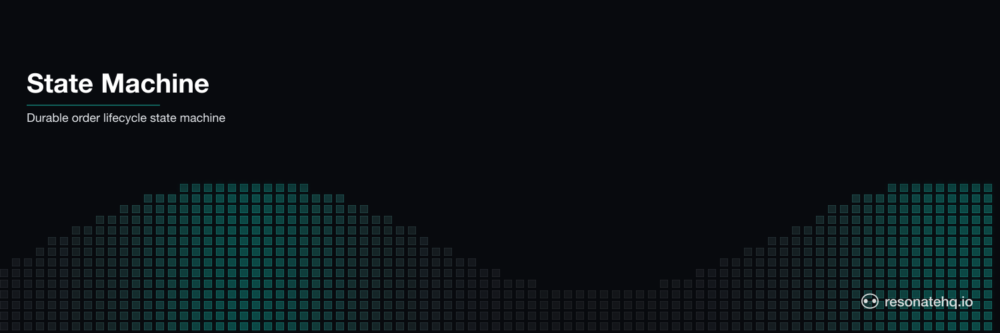

<p align="center">
  <picture>
    <source media="(prefers-color-scheme: dark)" srcset="./assets/banner-dark.png">
    <source media="(prefers-color-scheme: light)" srcset="./assets/banner-light.png">
    
  </picture>
</p>

# State Machine (Order Lifecycle)

Durable state machine for an order entity. The order progresses through enforced state transitions — created → confirmed → shipped → delivered (or → cancelled → refunded). If the process crashes mid-transition, it resumes from the last completed state. No transitions execute twice.

## What This Demonstrates

- **State as execution position**: the generator's position IS the current state — no separate state store or K/V API required
- **Enforced transitions**: can't reach "shipped" without first reaching "confirmed" — the sequential code makes invalid transitions structurally impossible
- **Crash recovery mid-transition**: crash during "shipped" (carrier API timeout), resume from "shipped" — earlier transitions served from cache
- **Two valid paths**: happy path (delivered) and cancellation path (cancelled → refunded)

## How It Works

Each state transition is wrapped in `ctx.run()`, making it a durable checkpoint:

```typescript
export function* orderLifecycle(ctx: Context, orderId: string, path: "deliver" | "cancel" | "crash") {
  // CREATED
  history.push(yield* ctx.run(transitionTo, orderId, null, "created"));

  // CONFIRMED
  history.push(yield* ctx.run(transitionTo, orderId, "created", "confirmed"));

  if (path === "cancel") {
    history.push(yield* ctx.run(transitionTo, orderId, "confirmed", "cancelled"));
    history.push(yield* ctx.run(transitionTo, orderId, "cancelled", "refunded"));
    return { orderId, finalState: "refunded", history };
  }

  // SHIPPED (may crash on first attempt)
  history.push(yield* ctx.run(transitionTo, orderId, "confirmed", "shipped", path === "crash"));

  // DELIVERED
  history.push(yield* ctx.run(transitionTo, orderId, "shipped", "delivered"));

  return { orderId, finalState: "delivered", history };
}
```

On crash and resume, Resonate replays the workflow — but each `yield*` checks the promise store first. Completed transitions return their cached result immediately. The workflow resumes at the first uncompleted transition.

### Restate Comparison

Restate's Virtual Object approach stores state explicitly:

```typescript
// Restate: explicit K/V state storage
const status = await ctx.get<OrderStatus>("status") ?? "NEW";
switch (status) {
  case "CONFIRMED":
    await ctx.run(() => carrierAPI.ship(orderId));
    ctx.set("status", "SHIPPED");
    break;
}
```

Resonate's approach: the generator's execution position IS the status. No `ctx.get`/`ctx.set`. State transitions are enforced by the code structure, not by guard clauses reading a K/V store.

## Prerequisites

- [Bun](https://bun.sh) v1.0+

No external services required. Resonate runs in embedded mode.

## Setup

```bash
git clone https://github.com/resonatehq-examples/example-state-machine-ts
cd example-state-machine-ts
bun install
```

## Run It

**Happy path** — order delivered successfully:
```bash
bun start
```

```
=== Order Lifecycle State Machine ===
Mode: HAPPY PATH  (created → confirmed → shipped → delivered)
Order: order-1771899132565

  [order-1771899132565]  — → created  ✓
  [order-1771899132565]  created → confirmed  ✓
  [order-1771899132565]  confirmed → shipped  ✓
  [order-1771899132565]  shipped → delivered  ✓

=== Result ===
{
  "orderId": "order-1771899132565",
  "finalState": "delivered",
  "transitions": 4,
  "wallTimeMs": 267
}
```

**Cancellation path** — customer cancels after confirmation:
```bash
bun start:cancel
```

```
  [order-...]  — → created  ✓
  [order-...]  created → confirmed  ✓
  [order-...]  confirmed → cancelled  ✓
  [order-...]  cancelled → refunded  ✓

  "finalState": "refunded"
```

**Crash mode** — carrier API fails during shipment creation:
```bash
bun start:crash
```

```
  [order-...]  — → created  ✓
  [order-...]  created → confirmed  ✓
  [order-...]  confirmed → shipped  ✗  (carrier API timeout, retrying...)
Runtime. Function 'transitionTo' failed with 'Error: ...' (retrying in 2 secs)
  [order-...]  confirmed → shipped (retry 2)  ✓
  [order-...]  shipped → delivered  ✓

Notice: created and confirmed each logged once (cached before crash).
Only shipped was retried — and only once.
delivered was NOT affected by the carrier API failure.
```

## What to Observe

1. **Exactly-once transitions**: in crash mode, `created` and `confirmed` each appear exactly once in the output — they completed before the crash and are served from cache on resume.
2. **Retry message from the SDK**: `Runtime. Function '...' failed (retrying in N secs)` is Resonate's built-in retry. You don't write any retry logic.
3. **Cancellation is a first-class path**: the generator branches naturally with an `if` statement — no state machine configuration, no transition tables.
4. **Invalid transitions are impossible**: there is no code path that reaches "shipped" without first passing through "confirmed". The structure enforces it.

## File Structure

```
example-state-machine-ts/
├── src/
│   ├── index.ts       Entry point — Resonate setup and demo runner
│   ├── workflow.ts    Order lifecycle generator — the state machine
│   └── transitions.ts State transition logic and crash simulation
├── package.json
└── tsconfig.json
```

**Lines of code**: ~241 total, ~50 lines of state machine logic (workflow.ts minus comments).

## Comparison

| | Resonate | Restate |
|---|---|---|
| State storage | Generator execution position | K/V store (`ctx.get`/`ctx.set`) |
| Transition enforcement | Code structure (generator flow) | Guard clauses reading state |
| State machine code | ~50 LOC | ~90 LOC (payment_service.ts) |
| Infrastructure | None | Restate server |
| Concurrent access | Same promise ID = idempotent | Per-key exclusive lock |

Restate's Virtual Object gives you per-key serialization of concurrent calls — two callers racing to transition the same order ID are automatically queued. Resonate handles this differently: two callers using the same workflow ID get the same cached result (idempotency). For true concurrent state access (multiple callers racing to mutate the same entity), Restate's Virtual Object model is more explicit.

## Learn More

- [Resonate documentation](https://docs.resonatehq.io)
- [Restate payment state machine](https://github.com/restatedev/examples/tree/main/typescript/patterns-use-cases/src/statemachinepayments)
- [Restate virtual objects intro](https://github.com/restatedev/examples/blob/main/typescript/basics/src/2_virtual_objects.ts)
